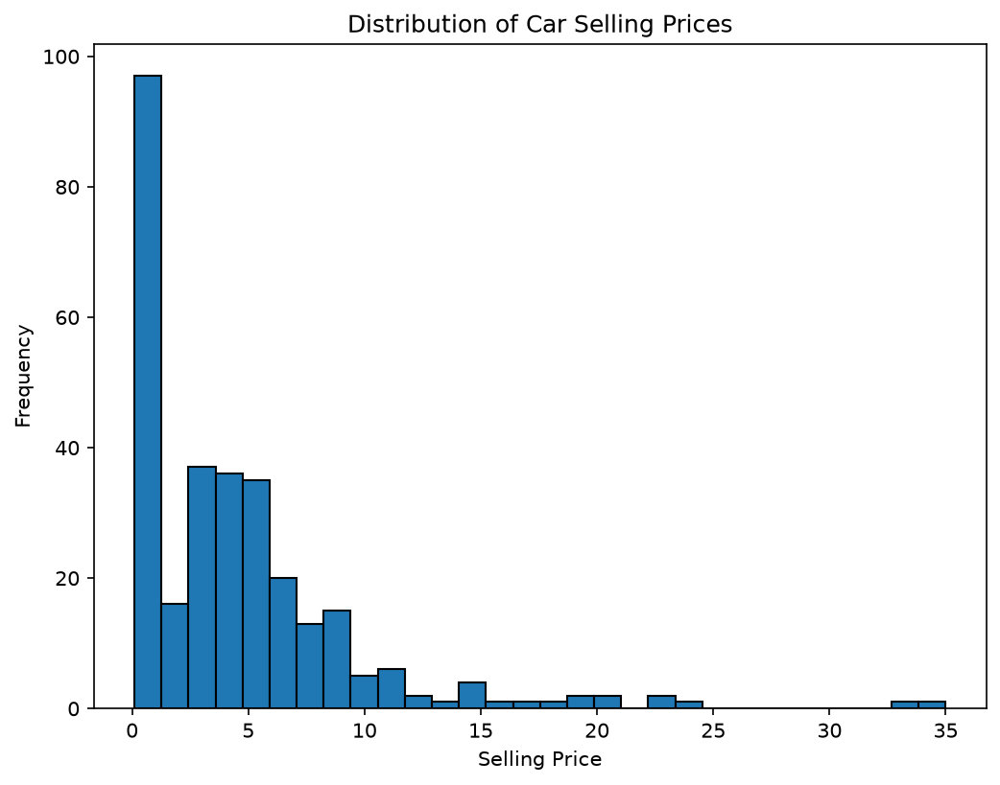
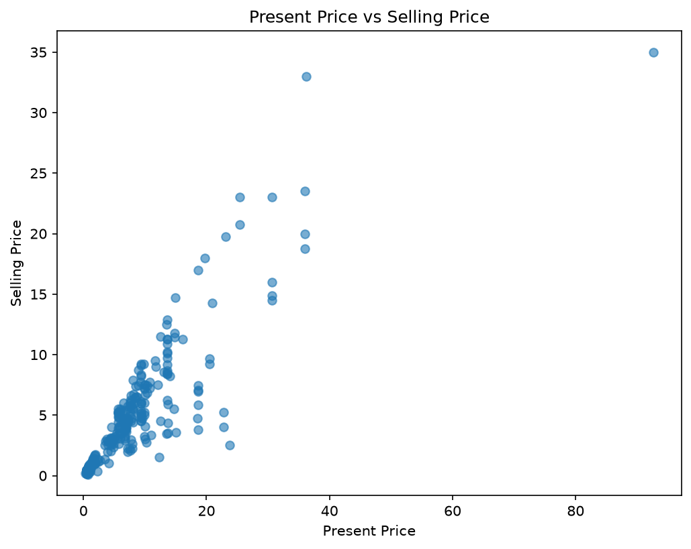
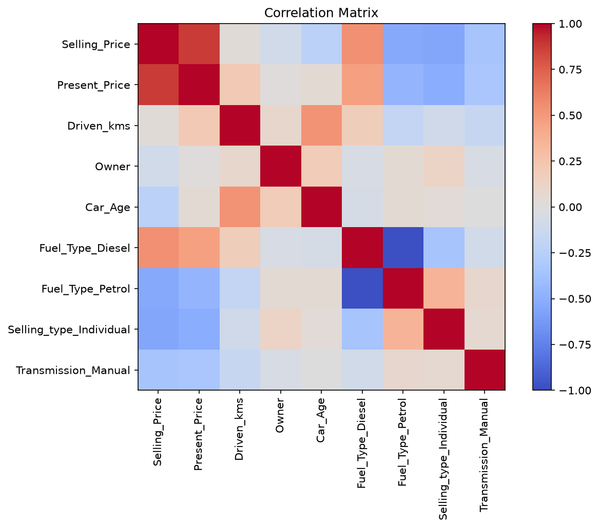
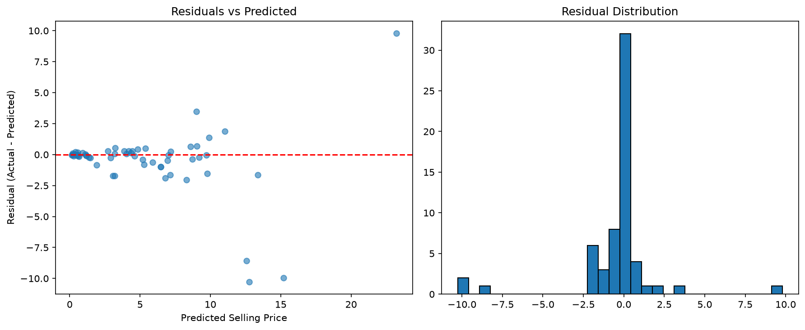
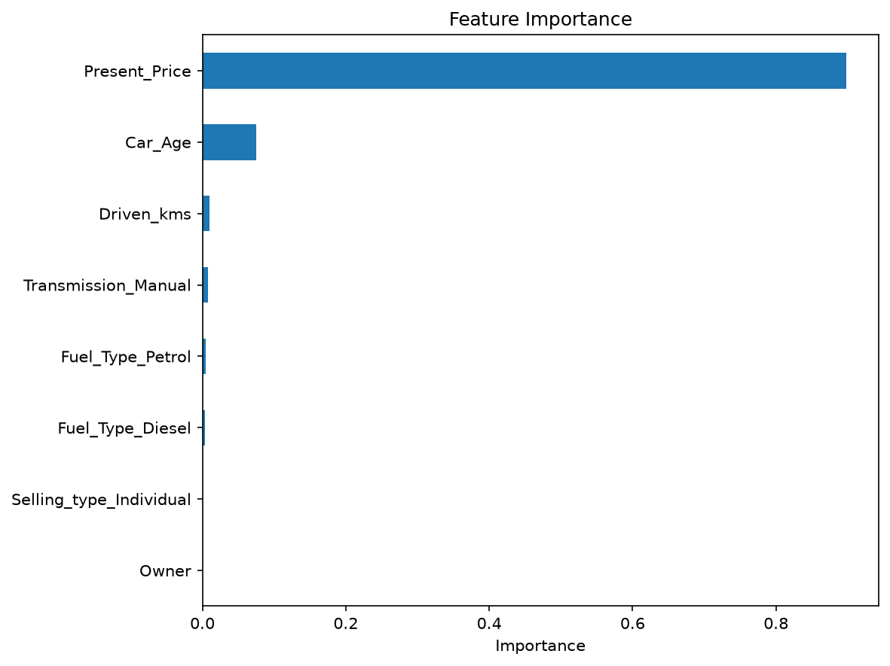

# Car Price Prediction

Internship project (CodeAlpha) — training a regression model to predict the selling price of used cars based on features like present price, mileage, fuel type, transmission, and age.

## Dataset
- Source: `car data.csv` (301 samples of used car listings)
- Target: `Selling_Price`
- Features: `Present_Price`, `Driven_kms`, `Fuel_Type`, `Selling_type`, `Transmission`, `Owner`, `Car_Age`,`Year`

## Approach
1. Data cleaning (checked for missing values and duplicates)
2. Feature engineering:
   - Converted `Year` into `Car_Age` (more useful for prediction than a raw year)
   - Dropped `Car_Name` (too many unique values to encode meaningfully)
   - One-hot encoded categorical columns (`Fuel_Type`, `Selling_type`, `Transmission`)
3. Visualized price distribution, present price vs. selling price, and feature correlations
4. Scaled features with `StandardScaler` (used for the baseline model)
5. Trained a **Linear Regression** model as a baseline
6. Used 5-fold cross-validation to tune the learning rate for a **Gradient Boosting Regressor**
7. Trained a final Gradient Boosting model with the best learning rate
8. Evaluated both models with MAE, RMSE, and R², and analyzed residuals and feature importance

## Results
- **Model:** Gradient Boosting Regressor (learning_rate = `<insert best_learning_rate>`)
- **Baseline model:** Linear Regression

| Model | MAE | RMSE | R² |
|-------|-----|------|-----|
| Linear Regression (baseline) | `<baseline_mae>` | `<baseline_rmse>` | `<baseline_r2>` |
| Gradient Boosting (final) | `<final_mae>` | `<final_rmse>` | `<final_r2>` |

Full summary: [results/model_summary.txt](results/model_summary.txt)

> Note: MAE and RMSE are in the same units as Selling Price. Lower is better for both. R² closer to 1.0 means the model explains more of the variance in car prices.

## Visualizations

**Selling Price Distribution**


**Present Price vs Selling Price**


**Correlation Matrix**


**R² vs Learning Rate**


**Residuals**


**Feature Importance**


## Project Structure
```
CodeAlpha_CarPricePrediction/
├── dataset/                  # car_data.csv
├── images/                   # Saved plots
├── results/                  # Model, scaler, and evaluation results
├── CarPricePredictions.py
├── requirements.txt
└── README.md
```

## How to Run
```bash
pip install -r requirements.txt
python CarPricePredictions.py
```

## Author
Siyolise Mbadu — CodeAlpha Internship